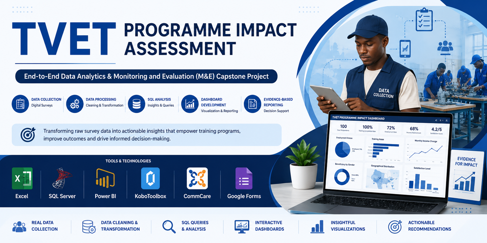
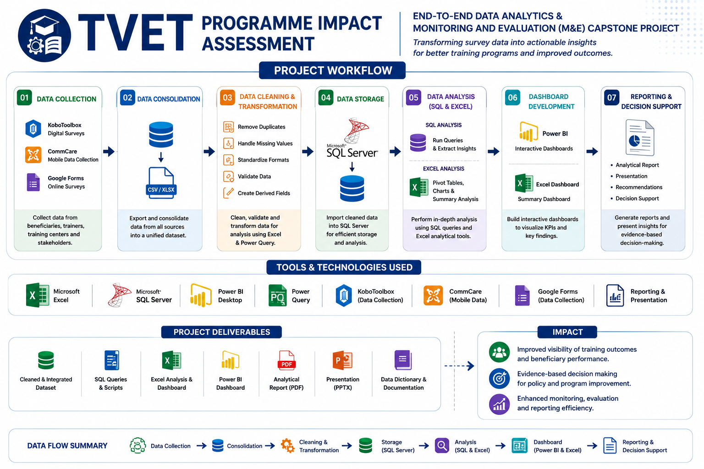
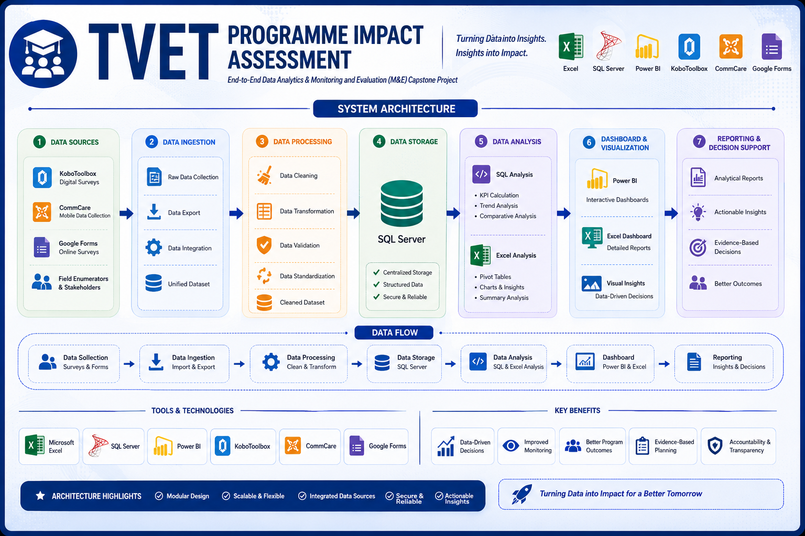
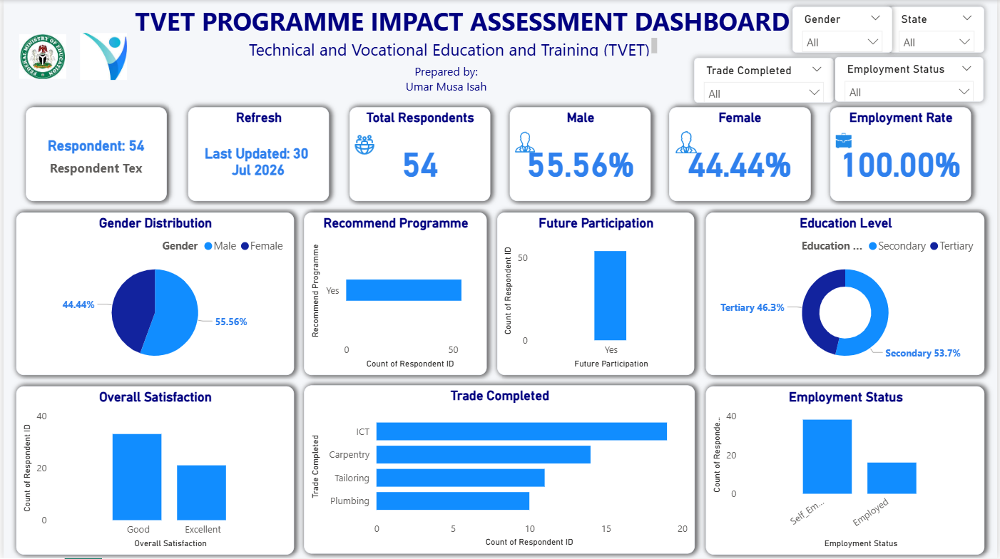
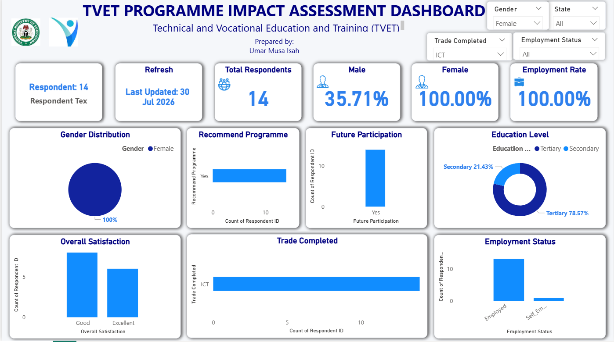
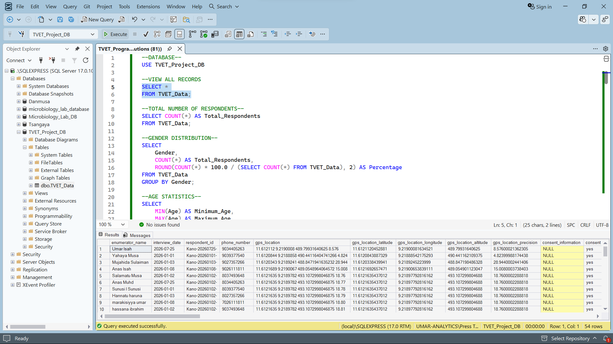
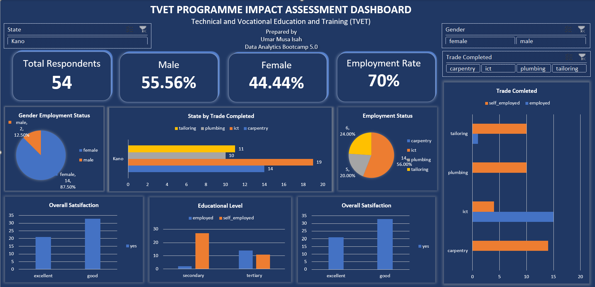

# TVET Programme Impact Assessment

### End-to-End Data Analytics & Monitoring and Evaluation (M&E) Capstone Project


---

# Project Overview

The **TVET Programme Impact Assessment** is an end-to-end Data Analytics and Monitoring & Evaluation (M&E) capstone project developed to evaluate the effectiveness and impact of a Technical and Vocational Education and Training (TVET) programme.

The project follows a complete analytics workflow beginning with digital data collection, data cleaning, transformation, statistical analysis, SQL analysis, dashboard development, technical reporting, and presentation.

Data was collected using KoboToolbox, CommCare, and Google Forms before being processed in Microsoft Excel and Power Query. SQL Server was used for relational data analysis, while Microsoft Power BI was used to develop an interactive dashboard that communicates key programme insights for evidence-based decision-making.

---

# Business Problem

Technical and Vocational Education and Training (TVET) programmes aim to improve employability, enhance vocational skills, and promote economic empowerment. However, programme managers and decision-makers often face challenges in measuring programme effectiveness due to fragmented datasets, inconsistent reporting, and limited analytical insights.

Without structured analysis, it becomes difficult to evaluate participant outcomes, identify implementation gaps, measure employment impact, and make informed decisions for future programme improvements.

This project addresses these challenges by transforming survey data into actionable insights through an end-to-end analytics workflow.

---

# Project Objectives

The primary objectives of this project are to:

- Evaluate participant demographics and programme reach.
- Assess participant satisfaction with the training programme.
- Measure employment outcomes after programme completion.
- Identify the most successful vocational trades.
- Examine relationships between training quality and employment.
- Analyse programme participation across demographic groups.
- Develop interactive dashboards for programme monitoring.
- Produce evidence-based recommendations to support decision-making.

---

# Project Workflow



The project followed a structured end-to-end analytics process consisting of:

1. Digital Data Collection
2. Data Cleaning
3. Data Transformation
4. SQL Analysis
5. Excel Analysis
6. Dashboard Development
7. Reporting
8. Presentation

---

# Solution Architecture



The architecture demonstrates how data flows from multiple digital collection platforms into a unified analytical environment where cleaning, transformation, SQL analysis, dashboard development, reporting, and presentation are performed.

---

# Dataset Information

| Item | Description |
|------|-------------|
| Project Domain | Technical & Vocational Education (TVET) |
| Project Type | Monitoring & Evaluation (M&E) |
| Dataset Source | Survey Responses |
| Collection Tools | KoboToolbox, CommCare, Google Forms |
| Data Format | Microsoft Excel |
| Database | SQL Server |
| Dashboard Tool | Microsoft Power BI |
| Reporting Tool | Microsoft PowerPoint |

---

# Data Collection

Survey data was collected using three digital platforms to demonstrate practical experience with modern Monitoring & Evaluation tools.

- KoboToolbox
- CommCare
- Google Forms

The questionnaire captured information on participant demographics, training experience, employment outcomes, programme satisfaction, vocational trade, challenges, and recommendations.

---

# Data Cleaning & Transformation

The dataset was cleaned and transformed using Microsoft Excel and Power Query.

Key activities included:

- Removing duplicate records
- Handling missing values
- Correcting inconsistent entries
- Standardising categorical variables
- Renaming variables for analysis
- Creating calculated columns
- Validating data quality
- Preparing the analytical dataset for SQL Server and Power BI

---

# SQL Analysis

SQL Server was used to create the project database and perform analytical queries.

The SQL analysis focused on:

- Employment status distribution
- Gender analysis
- Training centre performance
- Satisfaction analysis
- Vocational trade analysis
- Employment duration
- State and LGA comparisons
- Summary statistics

---

# Excel Analysis

Microsoft Excel was used to perform descriptive statistics and exploratory analysis.

The analysis included:

- Pivot Tables
- Pivot Charts
- Frequency Tables
- Percentage Analysis
- Cross-tabulation
- KPI calculations
- Interactive Excel Dashboard

---

# Power BI Dashboard

The Power BI dashboard provides an interactive view of programme performance using KPIs, charts, slicers, and analytical visuals.

Dashboard KPIs include:

- Total Respondents
- Male Respondents
- Female Respondents
- Employment Rate

The dashboard enables stakeholders to explore programme performance across different demographic and operational dimensions.
---

# Dashboard Preview

## Executive Dashboard



The executive dashboard provides a high-level summary of the TVET programme, presenting key performance indicators and participant statistics in a single interactive view.

---

## Analytical Dashboard



This analytical dashboard enables users to explore programme performance through interactive visualizations covering employment outcomes, participant demographics, training satisfaction, vocational trades, and programme recommendations.

---

## SQL Analysis



SQL Server was used to build the project database and perform analytical queries that generated meaningful insights into participant demographics, employment outcomes, programme satisfaction, and training performance.

---

## Excel Dashboard



Microsoft Excel was used to perform exploratory data analysis, create Pivot Tables, develop summary statistics, and design an interactive dashboard for quick reporting and decision support.

---

# Key Findings

The analysis produced several important findings regarding the TVET programme:

### 1. Programme Participation

The programme successfully attracted participants from different demographic backgrounds, indicating broad community engagement.

### 2. Employment Outcomes

A considerable proportion of participants reported gaining employment or improving their livelihood after completing the training programme.

### 3. Participant Satisfaction

Most respondents expressed positive satisfaction with the quality of training, trainers, and overall learning experience.

### 4. Vocational Trades

Some vocational trades demonstrated stronger employment outcomes than others, highlighting areas where training programmes can maximize impact.

### 5. Training Centres

Performance varied across training centres, suggesting opportunities for continuous quality improvement and knowledge sharing.

### 6. Future Participation

The majority of respondents indicated their willingness to recommend the programme and participate in future training initiatives.

---

# Recommendations

Based on the findings, the following recommendations are proposed:

- Expand access to high-performing vocational trades.
- Strengthen partnerships with employers to improve graduate employment opportunities.
- Continue investing in practical, competency-based training.
- Improve monitoring and evaluation practices through routine data collection and reporting.
- Enhance programme quality assurance across all training centres.
- Promote continuous participant feedback to support evidence-based programme improvements.

---

# Project Deliverables

This repository contains the following project deliverables:

- Digital Survey Forms (KoboToolbox, CommCare, and Google Forms)
- Raw Dataset
- Cleaned Dataset
- Microsoft Excel Analysis Workbook
- SQL Server Database and Query Scripts
- Interactive Power BI Dashboard
- Interactive Excel Dashboard
- Project Documentation
- Data Dictionary
- Technical Report
- PowerPoint Presentation
- Dashboard Screenshots

---

# Repository Structure

```text
TVET-Programme-Impact-Assessment/
│
├── assets/
│   ├── banner.png
│   ├── thumbnail.png
│   ├── workflow.png
│   └── architecture.png
│
├── data/
│   ├── raw_data/
│   └── cleaned_data/
│
├── kobotoolbox/
├── commcare/
├── google_forms/
├── excel/
├── sql/
├── dashboard/
│   ├── powerbi/
│   ├── excel_dashboard/
│   └── screenshots/
├── documentation/
├── report/
├── presentation/
├── README.md
├── LICENSE
└── .gitignore
```

---

# Skills Demonstrated

This project demonstrates practical experience in:

- End-to-End Data Analytics
- Monitoring & Evaluation (M&E)
- Digital Data Collection
- Data Cleaning & Transformation
- Power Query
- SQL Server
- Microsoft Excel
- Power BI
- Dashboard Design
- Data Visualization
- KPI Development
- Report Writing
- Technical Documentation
- Presentation Design
- Evidence-Based Decision Support

---

# Business Impact

This project demonstrates how digital data collection, structured data management, and business intelligence tools can transform survey responses into actionable insights for programme monitoring, performance evaluation, and strategic decision-making.

The analytical workflow presented in this repository reflects real-world practices commonly used by development partners, NGOs, government institutions, and international organizations involved in Monitoring & Evaluation.

---

# Future Improvements

Potential enhancements for future versions of this project include:

- Integration with cloud-based databases
- Automated ETL pipelines
- Real-time dashboard updates
- Advanced predictive analytics
- Geographic Information System (GIS) visualization
- Machine learning models for employment prediction

---

# Tools & Technologies

- Microsoft Excel
- Power Query
- SQL Server
- Microsoft Power BI
- KoboToolbox
- CommCare
- Google Forms
- Microsoft Word
- Microsoft PowerPoint

---

# Author

**Umar Musa Isah**

Data Analyst | Monitoring & Evaluation (M&E) Specialist | Dashboard & Reporting Professional

📧 Email: umarmusapress@gmail.com

💼 LinkedIn: https://www.linkedin.com/in/umar-musa-isah-997821408

🐙 GitHub: https://github.com/UmarMusaIsah

---

# Portfolio Navigation

Explore more of my Data Analytics portfolio:

🔗 **Master Portfolio Repository**

https://github.com/UmarMusaIsah/data-analytics-portfolio

Featured Projects:

- UNICEF Education Monitoring Dashboard
- WFP Food Security Dashboard
- UNDP M&E Indicator Tracker
- TVET Programme Impact Assessment

---

# Acknowledgements

This project was completed as part of a Data Analytics Bootcamp Capstone Project and showcases practical application of data analytics, monitoring & evaluation principles, dashboard development, SQL analysis, and evidence-based reporting using industry-standard tools.

---

> **Turning data into actionable insights for smarter decisions.**
